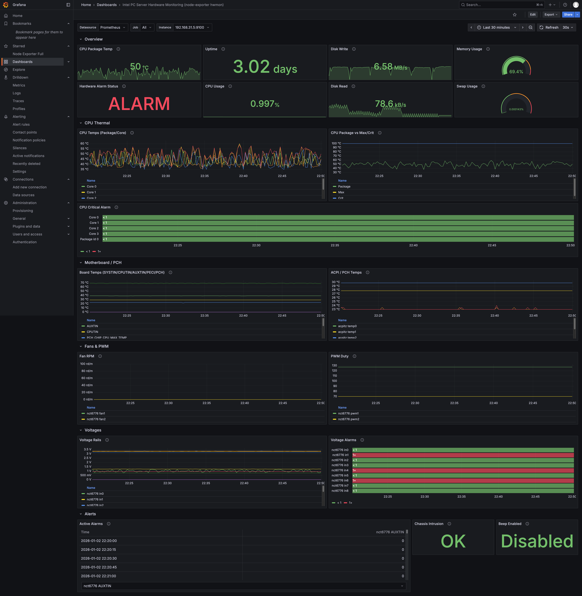

# Intel PC Server Hardware Monitoring (node-exporter hwmon)

一个基于 Prometheus + Grafana 的硬件监控仪表盘，数据来源于 `lm-sensors` 与 `node-exporter` 的 `hwmon` 采集器。该仪表盘面向 Intel PC 服务器（及相近平台）设计，尽量保持标签可读、可用、易于定位问题。

[English README](README.md)

## 项目内容

- `grafana-dashboard.json`：可直接导入的 Grafana 仪表盘。
- `raw-data.md`：`sensors` 输出与 `node-exporter` 指标的对应参考。
- `raw-data.txt`：开发过程中的原始采集记录。

## 依赖

- Prometheus + `node-exporter`。
- `node-exporter` 启用 `--collector.hwmon`。
- 安装并配置 `lm-sensors`，确保 `/sys/class/hwmon` 有有效数据。

## 快速开始

1) 在目标主机安装并配置 `lm-sensors`。
2) 使用 `node-exporter` 并启用 `hwmon` 采集器。
3) 在 Grafana 中导入 `grafana-dashboard.json`。
4) 选择 Prometheus 数据源，并选择 `job` / `instance`。

## 仪表盘概览

仪表盘按行组织：

- Overview（CPU 温度、运行时间、磁盘、内存、告警状态）
- CPU Thermal（封装/核心温度、阈值、临界告警）
- Motherboard / PCH（主板传感器、ACPI 热区）
- Fans & PWM（转速、占空比）
- Voltages（电压轨与告警）
- Alerts（可读标签的活动告警）

## 变量

- `DS_PROMETHEUS`：Prometheus 数据源。
- `job`：Prometheus 的 job 标签（支持 `All`）。
- `instance`：Prometheus 的 instance 标签（支持 `All`）。

所有面板查询均使用正则匹配（`=~`）以兼容 `All`。

## 兼容性说明

- 不同主板的芯片与传感器命名差异较大。本仪表盘会关联：
  - `node_hwmon_chip_names` 用于可读芯片名。
  - `node_hwmon_sensor_label` 用于可读传感器标签。
- 部分通道可能未接线或不可用（例如 `0.0°C` 或 `ALARM`）。如有需要可用 Grafana Transform 过滤。
- 并非所有平台都有 PWM 或风扇通道，缺失属正常现象。

## 故障排查

- **面板无数据**：检查 `node-exporter` 是否暴露 `node_hwmon_*` 指标，以及 `job`/`instance` 是否存在。
- **标签不可读**：检查 Prometheus 是否采集到 `node_hwmon_sensor_label` 和 `node_hwmon_chip_names`。
- **异常 `ALARM`**：通常与阈值未配置或通道不可用有关，可对照 `sensors` 输出确认。

## 贡献

欢迎贡献，建议方向：

- 扩展对更多 Super I/O 芯片和平台的兼容。
- 改进对无效通道的过滤与面板转换。
- 提供截图与真实硬件验证笔记。
- 增加其他发行版的部署说明。

欢迎提交 PR 并附上硬件相关信息。

## 参考环境

- Intel NUC 6i
- Proxmox VE (PVE)
- `lm-sensors` + `node-exporter` `hwmon` 采集器
